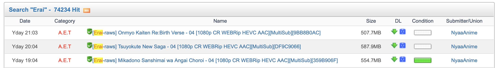

## 01-如何获取源视频

对于获取源视频，主流的途径有两种：「获取公开的视频源」与「购买相关的视频源」。

1. 公开视频源网站

|      地域      | 名称           | 网站                                      |                                                                           简评                                                                           |
| :------------: | -------------- | ----------------------------------------- | :------------------------------------------------------------------------------------------------------------------------------------------------------: |
| Global-English | *Nyaa          | [https://nyaa.si/](https://nyaa.si/)         |          以英文、俄文为主，主流动漫源网站，地位几乎不可撼动。大部分动漫源都会被发布在上面。但是由于©️等原因，至今限制「新用户注册发布种子」。          |
| Global-English | *Acgnx         | [https://www.acgnx.se](https://www.acgnx.se) |                                          以英文为主，内容多为镜像Nyaa。但可以注册新用户发布种子，面对国际用户。                                          |
|       CN       | 末日动漫资源库 | [https://share.acgnx.se]()                   |                 中文地区里「最为全面」的动漫网站。部分动漫字幕组会在此创建账号，发布相关作品。其同步众多动漫发布平台信息，但知名度较低。                 |
|       CN       | 动漫花园       | [https://share.dmhy.org/]()                  |       中文地区「知名度最高」的动漫网站。大部分动漫字幕组会选择在此网站，发布相关作品。但由于知名度过高，出现超多模仿、镜像网站，故其经常出现Bug。       |
|       CN       | 蜜柑计划       | [https://mikanani.me/]()                     | 中国大陆地区「知名度最高、内容较全」的动漫收录网站。在这里你可以找到新番及相关源，适合动漫收录党使用。但是因为介质的问题，字幕组较少直接发布在此网站上。 |

本组常用的「公开视频源网站」基本如上所示。但是对于较为稀缺的视频资源，可能需要通过「购买」的渠道获取，例如BD。

上述部分网站可能在部分地区存在失联现象，请通过各类方法成功访问，再次不多赘述。

2. 最为常见的视频源：[Erai-raws]

对于本组来说，采用最多视频源的组，就是[Erai-raws]，你可以直接在 Acgnx 搜索 [Erai-raws] ，然后选取自己需要的视频，通过种子下载相关视频文件。

本组常见的选取标准如下（参考）：

| 视频名称 - 集数 | 视频画质 | 视频源 | 视频类别 | 视频编码 | 字幕种类 | 视频文件大小 |
| --------------- | -------- | ------ | -------- | -------- | -------- | ------------ |
| xxx - 01        | 1080p    | CR     | WEB-DL   | AAC      | MultiSub | 1.3GB        |
| xxxx - 02       | 1080p    | AMZN   | WEB-DL   | -        | MultiSub | 1.3GB        |

为什么要选择更大体积的视频文件呢，因为相对越大的视频文件，码率对应的就越高，这样在理论上能得到更多视频信息。

从视频信息的角度将，码率越高，视频所包含的信息就更加多，所以画质会更加丰富、清晰。

但是我们在分发的时候，将会进行一定的视频压制。

为什么要压制呢？这个问题会在压制章节进行回答。

对于 HEVC 的视频编码的源，本组不建议选择使用。

但是有的时候也可以选择（例如说不想压制HEVC而直接使用现成的）。

3. 如何将视频下载下来

对于上述的内容，只是「找好了」视频，但是视频如何下载呢，这就是个问题。

例如我们看到这个：

我们只需要点击 DL 的「绿色箭头」就可以下载了，但是在那之前，请先安装好：qBittorrent 软件。

我们在准备工作曾经提到过相关软件，但是为了更好地避免下载到流氓安装包，所以请使用下面的版本：

| 名称 | 作用     | 下载网址                                                                 |
| ---- | -------- | ------------------------------------------------------------------------ |
| qBEE | 下载种子 | 下载链接：[GitHub](https://github.com/c0re100/qBittorrent-Enhanced-Edition) |

为什么我们推荐这款呢，因为相较与原来的 qBittorrent，这款更适合大多数人的使用习惯，以及其较为统一简单的下载安装方式，同时还可以「反吸血」，其自带可以更新的trackers list，相较于官方版本更加适合小白使用，不仅提高了用户下载的trackers链接数，更有利于项目做种，同时屏蔽了迅雷吸血。本组虽然没有屏蔽迅雷吸血下载，但明确反对使用迅雷下载本字幕组资源（一般字幕组都会屏蔽掉迅雷以防止其吸血，具体原因可Google搜索）。

对于软件的使用，如果有不懂的内容，可以询问AI解答，或者去相关视频网站学习。

然后你就会得到长串名称的视频源文件，这个时候请不要着急，因为你还没有办法打开。

---

至此你已经学会了如何获取源视频，但是我们获取到的源视频，是无法保证一定可以观看的，因为「BT」的断点续传以及切分的特性，可能会导致视频正常观看，这个时候，我们就要检验视频是否存在画面损坏。那么一种最为简单的方法，就是观看视频。这就引出了这一章的最后一个问题：如何观看视频。

4. 如何观看视频

为什么我会写这个呢，原因很简单，在 MacOS 上的视频播放器较为稀缺，而 Windows Player 较为傻缺，所以本组推荐一些开源的播放器：

| 名称      | 作用               | 下载网址                                          |
| --------- | ------------------ | ------------------------------------------------- |
| IINA      | MacOS 视频播放器   | 下载链接：[官网](https://iina.io)                    |
| PotPlayer | Windows 视频播放器 | 下载链接：[官网  ](https://potplayer.info/download/) |
| VLC       | 全平台多媒体播放器 | 下载链接：[官网](https://www.videolan.org/vlc/)      |

同时，PotPlayer 还有一项很重要的功能，之后会作为补充讲解，这种问题目前在 MacOS上，只能通过Windows ARM 内置的 x86 模拟层（WOW64）强行使用potplayer，但是这部分将会作为选择进行讲解，因为这种办法只是为了解决一个小问题而已，我们有其它的方法能够解决相关问题。
