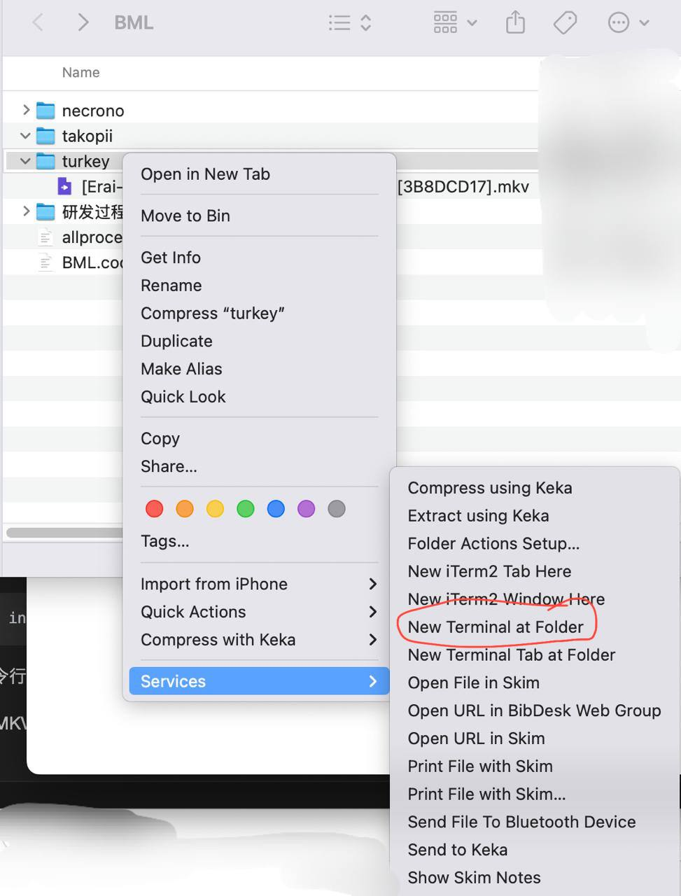
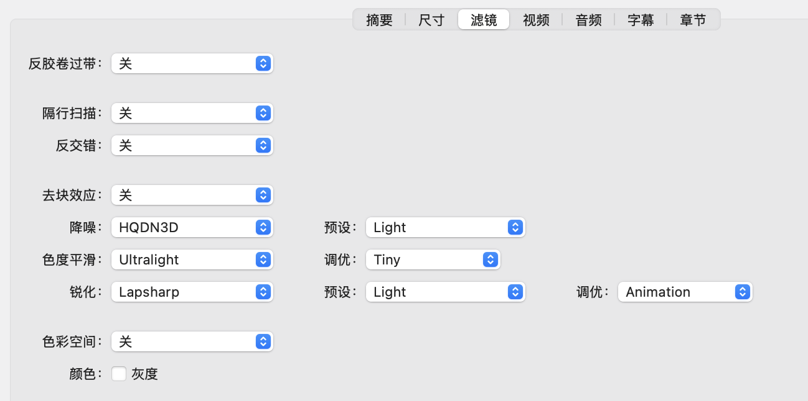
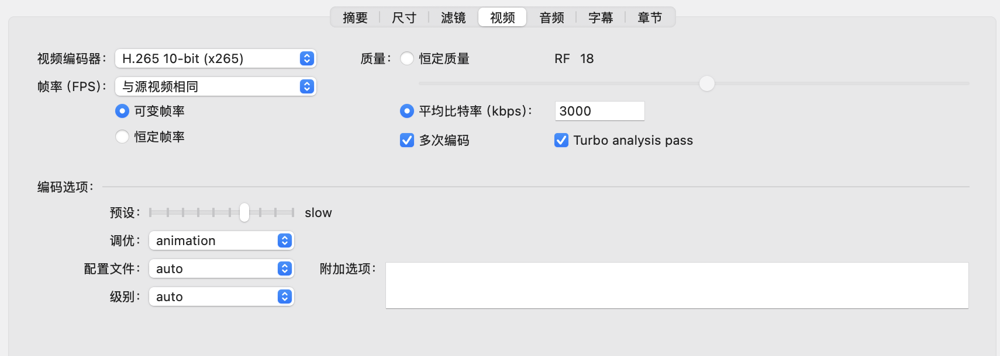

## 如何对原视频进行预处理

对于这个部分，本组将会接着上一篇文章进行处理讲解。关于 TV-raws 的处理，后期会进行补充。

假设我们下载的视频文件是：

```
[Erai-raws] Turkey - 03 [1080p CR WEB-DL AVC AAC][MultiSub][3B8DCD17].mkv
```

这是一个 MKV 文件，那么我们需要什么呢？一般来说，我们需要它的「音频」和「时间轴」。

但是这个视频文件名称好复杂，我们就改为：

```
03.mkv
```

音频，就是单独的音频轨道；时间轴，就是官方字幕（多以英文、法语、俄语为主）。

那么我们如何查看 MKV 视频里面的信息，提取我们需要的内容呢？

这里就要使用到 MacOS 强大的软件管理能力。

1. 安装 [homebrew](https://brew.sh) 及 MKVToolNix

对于现在使用 MacOS 的群体，homebrew是必不可少的软件，而安装它也很简单，只需要在「Terminal」输入一行命令。

```python
/bin/bash -c "$(curl -fsSL https://raw.githubusercontent.com/Homebrew/install/HEAD/install.sh)"
```

然后等待一段时间，就能安装成功，同时，你还要根据需求配置好「环境变量」，详细内容在下面的知乎链接中。

如果有任何安装的问题，可以参考这篇文章：[知乎-如何安装 Homebrew](https://zhuanlan.zhihu.com/p/691007156)

然后，当你看到这里的时候，说明你的 Homebrew 已经安装完成了，环境变量也配置好了，我们就安装 MKVToolNix。

```
brew install --cask mkvtoolnix
```

安装后，命令行工具如  `mkvextract`、`mkvinfo`、`mkvmerge` 会一并安装完成，而且也会有 GUI 界面。

2. 查看并提取 MKV 视频信息

首先，介绍一种比较通用的方法。

在 MacOS 中，在制定文件夹下调用 Termianl 的方法，一般选中文件夹，然后按下图所示：



然后就能进到 Terminal 的界面，这时候我们输入以下代码，就能查看 MKV 视频信息：

输入：

```
mkvmerge -i 03.mkv
```

如果没有改名，输入视频需要加英文单引号：

```
mkvmerge -i '[Erai-raws] Turkey - 03 [1080p CR WEB-DL AVC AAC][MultiSub][3B8DCD17].mkv'
```

输出：

```
File '03.mkv': container: Matroska
Track ID 0: video (AVC/H.264/MPEG-4p10)
Track ID 1: audio (AAC)
Track ID 2: subtitles (SubStationAlpha)
Track ID 3: subtitles (SubStationAlpha)
Track ID 4: subtitles (SubStationAlpha)
Track ID 5: subtitles (SubStationAlpha)
Track ID 6: subtitles (SubStationAlpha)
Track ID 7: subtitles (SubStationAlpha)
Track ID 8: subtitles (SubStationAlpha)
Track ID 9: subtitles (SubStationAlpha)
Track ID 10: subtitles (SubStationAlpha)
Attachment ID 1: type 'application/x-truetype-font', size 286620 bytes, file name 'arialbd_3.ttf'
Attachment ID 2: type 'application/x-truetype-font', size 275572 bytes, file name 'Arial_2.ttf'
Attachment ID 3: type 'application/x-truetype-font', size 117028 bytes, file name 'ariblk_1.TTF'
Attachment ID 4: type 'application/x-truetype-font', size 126364 bytes, file name 'comic_0.ttf'
Attachment ID 5: type 'application/x-truetype-font', size 311508 bytes, file name 'courbd_0.ttf'
Attachment ID 6: type 'application/x-truetype-font', size 136076 bytes, file name 'impact_0.ttf'
Attachment ID 7: type 'application/x-truetype-font', size 867988 bytes, file name 'tahomabd_2.ttf'
...
```

我们看到，第一条轨道是存放视频的，标记为轨道0，（在计算机中，0常常表示第一个）。

第二条轨道是音频，后面的2-10则都是字幕轨道。一般来说，第一条字幕轴多以英文为主。

而 Attachment 则表示「附件」，而这些给出的附件都是「.ttf」结尾的，说明是字体文件，一般情况下用不到。

而提取音频和字幕，只需要再输入一行命令：

输入：

```
mkvextract tracks 03.mkv 1:audio.aac 2:subtitle.ass
```

输出：

```
Extracting track 1 with the CodecID 'A_AAC' to the file 'audio.aac'. Container format: raw AAC file with ADTS headers
Extracting track 2 with the CodecID 'S_TEXT/ASS' to the file 'subtitle.ass'. Container format: SSA/ASS text subtitles
Progress: 100%
```

含义：

* `03.mkv` 是原始 MKV 文件；
* `1:audio.aac` 表示提取「Track ID 1」为音频文件 audio.aac ；
* `2:subtitle.ass` 表示提取「Track ID 2」为字幕文件 subtitle.ass 。

至此，我们所需要的内容已经准备好时轴和音频，接下来才是重点和难点。

3. 压制 HEVC 视频

这里就就提到了 HEVC 视频了！还记得我们在 01 讲的，不建议下载 HEVC 的版本源吗？

对于一些机器性能较差的组来说，直接使用体积适中、完成度高的 HEVC 版本源，然后分装好字幕即可。

例如：

```
[Erai-raws] Turkey - 03 [1080p CR WEBRip HEVC AAC][MultiSub][25231541].mkv (466.6 MiB)
```

可以直接下载，然后准备在内封字幕的时候使用。

但是我们想要自行压制，我们应该如何操作呢？

那么就又又又来一个新软件了：Handbrake

| 名称      | 简介                 | 链接                                 |
| --------- | -------------------- | ------------------------------------ |
| Handbrake | 跨平台视频压制软件   | 下载链接：[官网](https://handbrake.fr/) |
| FFmpeg    | 跨平台多媒体处理攻击 | homebrew                             |

这款软件是给予 FFmpeg 的一款开源视频处理软件。

本组常用来压制「内封字幕的 HEVC-10bit 视频文件」。

那么使用 Handbrake 很简单，只需要打开软件，选择需要压制的视频，然后开始就可以了。

例如本组的配置如下：






当然你也可以去附件下载「3000.json」的文件，然后通过「预设-导入」使用，其它保持默认即可。

根据使用经验，可以对「滤镜」进行微调，以适应不同的视频。

这样过了一段时间后（20-40分钟），就会导出压制好的视频，一般体积多在 500-600MB 之间。

4. 总结

我们通过几种方式，下载了需要
